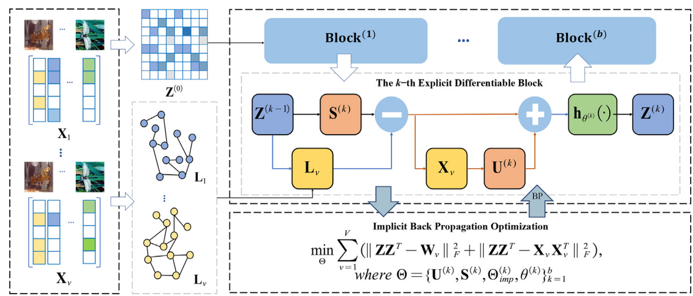

<h2 align="center"> <a href="https://www.sciencedirect.com/science/article/abs/pii/S0020025523000713">DBO-Net: Differentiable bi-level optimization network for multi-view clustering</a></h2>

<div align="center">

**Zihan Fang<sup>1,2</sup>, Shide Du<sup>1,2</sup>, Xincan Lin<sup>1,2</sup>, Jinbin Yang<sup>1,2</sup>, Shiping Wang<sup>1,2</sup>, Yiqing Shi<sup>3</sup>**

<sup>1</sup>College of Computer and Data Science, Fuzhou University, Fuzhou 350108, China<br>
<sup>2</sup>Fujian Provincial Key Laboratory of Network Computing and Intelligent Information Processing, Fuzhou University, Fuzhou 350116, China<br>
<sup>3</sup>College of Photonic and Electronic Engineering, Fujian Normal University, Fuzhou 350117, China<br>
</div>

## Abstract
Multi-view clustering on traditional optimization methods is derived from different theoretical frameworks, yet it may be inefficient in dealing with complex multi-view data compared to deep models. In contrast, deep multi-view clustering methods for implicit optimization have excellent feature abstraction ability but are inscrutable due to their black-box problem. However, very limited research was devoted to integrating the advantages of the above two types of methods to design an efficient method for multi-view clustering. Focusing on these problems, this paper proposes a differentiable bi-level optimization network (DBO-Net) for multi-view clustering, which is implemented by incorporating the traditional optimization method with deep learning to design an interpretable deep network. To enhance the representation capability, the proposed DBO-Net is constructed by stacking multiple explicit differentiable block networks to learn an interpretable consistent representation. Then all the learned parameters can be implicitly optimized through back-propagation, making the learned representation more suitable for the clustering task. Extensive experimental results validate that the strategy of bi-level optimization can effectively improve clustering performance and the proposed method is superior to the state-of-the-art clustering methods.

## Model Architecture
<div align="center">
  
</div>

## Experiment


###  Requirements

To install requirements:

```
conda env create -f DBO.yml
```

### Datasets
We conducted experiments on six publicly available multi-view datasets [link](https://drive.google.com/drive/folders/1Jh4IHkpoLcFe6slS_-jXZ7uFqYIaNJ-1):

| Datasets    | # Samples | # Views | # Features                          | # Classes |
|-------------|-----------|---------|-------------------------------------|-----------|
| ALOI        | 1,079     | 4       | 64 / 64 / 77 / 13                   | 10        |
| Caltech101 | 9,144     | 6       | 48 / 40 / 254 / 1,984 / 512 / 928   | 102       |
| MNIST      | 10,000    | 3       | 30 / 9 / 30                         | 10        |
| MITIndoor  | 5,360     | 4       | 3,600 / 1,770 / 1,240 / 4,096       | 67        |
| NUS-WIDE   | 1,600     | 6       | 64 / 144 / 73 / 128 / 225 / 500     | 8         |
| Scene15    | 4,485     | 3       | 1,800 / 1,180 / 1,240               | 15        |

###  Run

Training and evaluation.

```run
python run.py
```


## Reference

If you find our work useful in your research, please consider citing:

```
@article{fang2023dbo,
  title={Dbo-net: Differentiable bi-level optimization network for multi-view clustering},
  author={Fang, Zihan and Du, Shide and Lin, Xincan and Yang, Jinbin and Wang, Shiping and Shi, Yiqing},
  journal={Information Sciences},
  volume={626},
  pages={572--585},
  year={2023},
  publisher={Elsevier}
}
```

